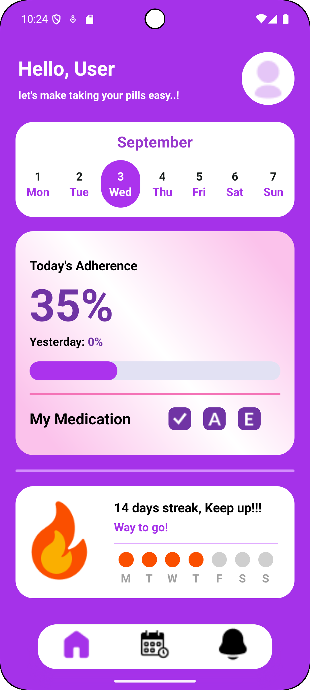

# DawaSathi – A Smart Medicine Reminder App for Timely Pill Management

A React Native-based mobile app designed to help elderly people keep track of their medication intake with smart reminders, progress tracking, and detailed statistics.

## ⚠️ Development Status

**This app is still under development and may not work properly out of the box.** Please review and configure the code before running to ensure proper functionality.

## Features

- 💊 **Smart Pill Tracking** - Monitor morning, afternoon, and evening medication intake
- 📊 **Daily Statistics** - View today's medication progress with completion percentages
- 📈 **Progress Comparison** - Compare previous day's intake with current day performance
- 🔥 **Streak Counter** - Track consecutive days of complete medication adherence
- ⏰ **Customizable Reminders** - Set personalized reminder times for all three daily periods
- 🔔 **Smart Notifications** - Get timely pill reminders and missed medication alerts
- 👥 **Elderly-Friendly UI** - Large fonts, clear icons, and intuitive navigation designed for seniors

## Screenshots

### Home Screen


### Schedules Screen


### Notification Screen


## Tech Stack

- **React Native CLI** - Cross-platform mobile development
- **NativeWind (Tailwind CSS)** - Styling and responsive design
- **React Navigation** - Navigation and routing
- **Axios** - HTTP client for API requests
- **React Native DateTime Picker** - Date and time selection
- **React Native Geolocation Service** - GPS location services
- **React Native Permissions** - Permission handling
- **React Native Safe Area Context** - Safe area handling

## Installation

### Prerequisites

Make sure you have completed the [React Native - Environment Setup](https://reactnative.dev/docs/getting-started-without-a-framework) instructions.

### Step 1: Clone the Repository

```bash
git clone https://github.com/yourusername/DawaSathi.git
cd DawaSathi
```

### Step 2: Install Dependencies

```bash
npm install
# or
yarn install
```

### Step 3: Setup NativeWind (Tailwind CSS)

Follow the [NativeWind installation guide](https://v2.nativewind.dev/getting-started/installation) or this [detailed tutorial](https://blog.logrocket.com/getting-started-nativewind-tailwind-react-native/).

### Step 4: Install iOS Dependencies (iOS only)

```bash
cd ios && pod install && cd ..
```

### Step 5: Platform-specific Setup

#### Android
- Add location permissions in `android/app/src/main/AndroidManifest.xml`
- Configure location services as needed

#### iOS
- Add location permissions in `ios/YourApp/Info.plist`
- Configure location usage descriptions

## Running the App

### For Android
```bash
npx react-native run-android
```

### For iOS
```bash
npx react-native run-ios
```

## Dependencies

```json
{
  "dependencies": {
    "@react-native-community/datetimepicker": "^8.4.2",
    "@react-navigation/bottom-tabs": "^7.4.2",
    "@react-navigation/native": "^7.1.14",
    "@react-navigation/native-stack": "^7.3.21",
    "axios": "^1.10.0",
    "moment": "^2.30.1",
    "nativewind": "^2.0.11",
    "react": "19.1.0",
    "react-native": "0.80.1",
    "react-native-geolocation-service": "^5.3.1",
    "react-native-linear-gradient": "^2.8.3",
    "react-native-permissions": "^5.4.1",
    "react-native-safe-area-context": "^5.5.1",
    "react-native-screens": "^4.11.1",
    "tailwindcss": "^3.3.2"
  }
}
```

## Key Features Implementation

### Medication Tracking System
- Three-period tracking (Morning, Afternoon, Evening)
- Progress updates with percentage completion
- Visual indicators for taken/missed medications

### Smart Reminder System
- Customizable reminder times for each medication period
- In-app otifications for pill times
- Missed medication alerts and follow-up reminders

### Progress Analytics
- Daily completion statistics
- Streak tracking for motivation and habit building

### UI/UX
- Senior-friendly interface with large, clear elements
- Intuitive navigation with bottom tabs

## 📱 Building APK

### Step 1: Prepare Build Directory
Make sure `android/app/src/main/assets/` exists. If not:
```bash
mkdir -p android/app/src/main/assets
```

### Step 2: Bundle the App
```bash
cd ..
npx react-native bundle \
  --platform android \
  --dev false \
  --entry-file index.js \
  --bundle-output android/app/src/main/assets/index.android.bundle \
  --assets-dest android/app/src/main/res
```

```bash
node node_modules/react-native/cli.js bundle \
  --platform android \
  --dev false \
  --entry-file index.js \
  --bundle-output android/app/src/main/assets/index.android.bundle \
  --assets-dest android/app/src/main/res
```

### Step 3: Build APK

**Option 1: Using Android Studio**
- Open the `android` folder in Android Studio
- Build the project from there

**Option 2: Using Command Line**
```bash
cd android
./gradlew assembleRelease
```

> **Note:** Build steps might change with React Native CLI updates

## 📝 Additional Notes

- **APK will be located at:** `android/app/build/outputs/apk/release/app-release.apk`